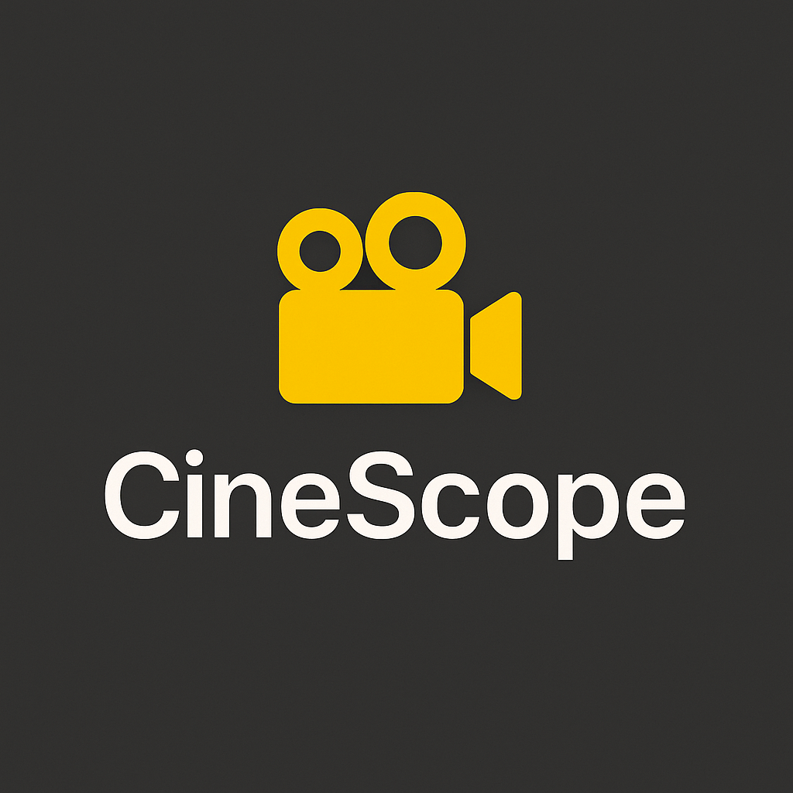
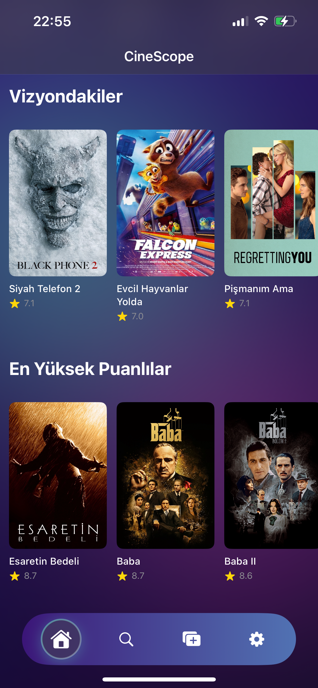
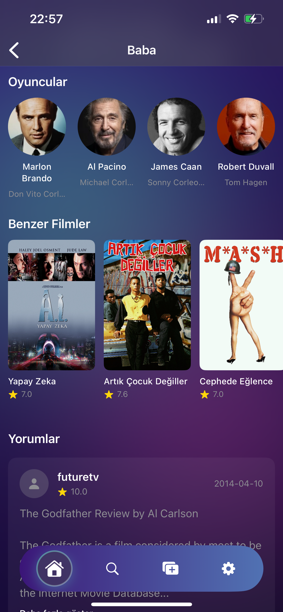
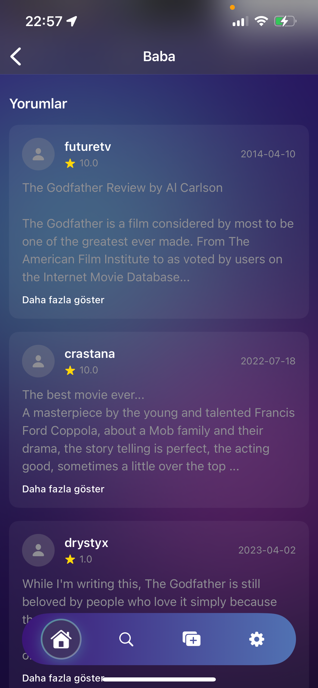
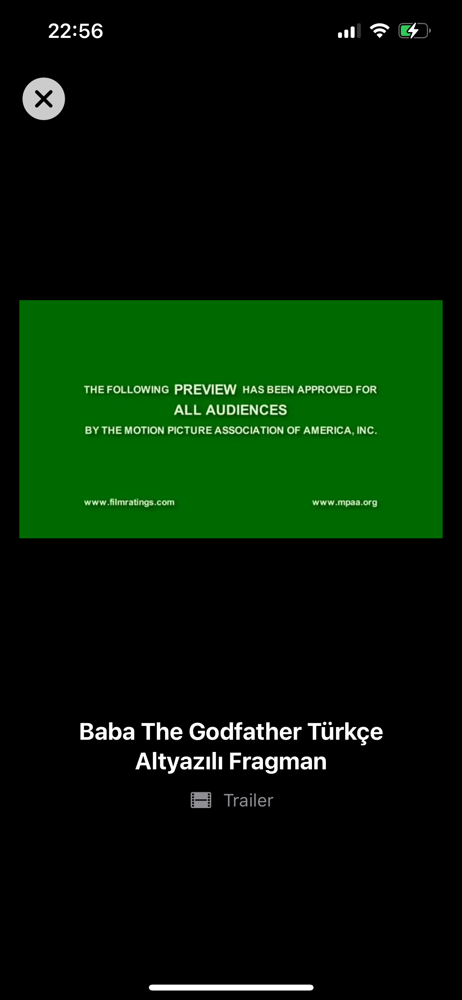
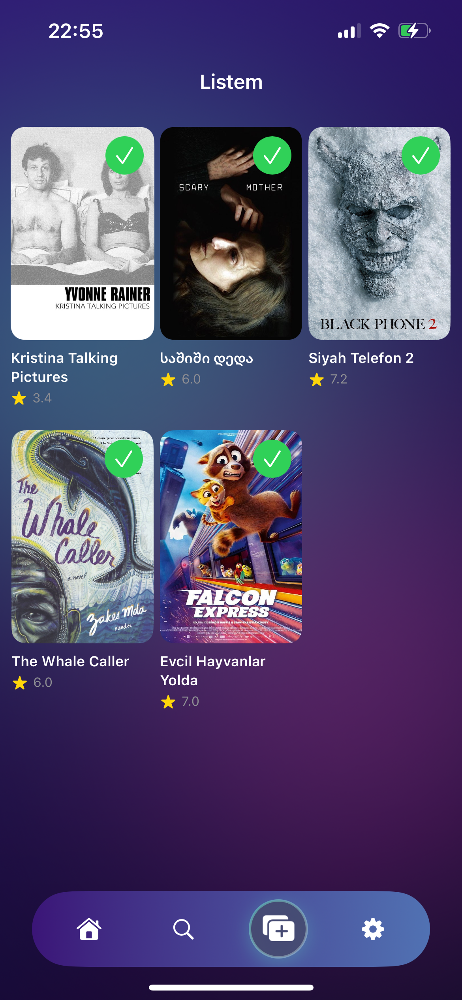
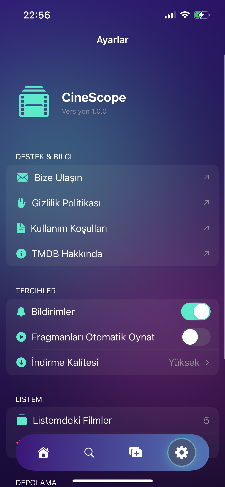

# 🎬 CineScope

<div align="center">
  
  <p><strong>Modern iOS Film Keşif Uygulaması</strong></p>
  <p>TMDB API ile güncel film bilgileri, fragmanlar ve detaylar</p>
</div>

---

## 📱 Ekran Görüntüleri

### Ana Sayfa & Keşfet
<p align="center">
  
  
  
</p>

### Film Detayları
<p align="center">
  
  
  
</p>

### Fragman Oynatıcı & Diğer
<p align="center">
  
  
  
</p>

---

## ✨ Özellikler

- 🎥 **Film Keşfi**: Trend olan, popüler, vizyondaki ve en yüksek puanlı filmler
- 🔍 **Gelişmiş Arama**: Film adına göre arama yapabilme
- 📽️ **Detaylı Bilgiler**: 
  - Film özeti ve bilgileri
  - Oyuncu kadrosu (Cast)
  - Ekip bilgileri (Crew)
  - Benzer filmler
  - Kullanıcı yorumları ve puanları
- 🎬 **Fragman Oynatıcı**: YouTube fragmanlarını uygulama içinde izleme
- ⭐ **Listem**: Favori filmlerinizi kaydedin ve yönetin
- 🎨 **Modern UI**: 
  - SwiftUI ile tasarlanmış, kullanıcı dostu arayüz
  - Karanlık tema desteği
  - Smooth animasyonlar
- 📱 **Tab Bar Navigation**: Kolay gezinme için alt menü

---

## 🛠️ Teknolojiler

- **SwiftUI**: Modern UI framework
- **Async/Await**: Modern asenkron programlama
- **MVVM Architecture**: Temiz ve sürdürülebilir kod yapısı
- **Singleton Pattern**: State management için
- **Kingfisher**: Görsel yükleme ve cache
- **YouTubePlayerKit**: YouTube video oynatıcı
- **TMDB API**: Film verileri için

---

## 📋 Gereksinimler

- iOS 17.0+
- Xcode 15.0+
- Swift 5.9+
- TMDB API Key

---

## 🚀 Kurulum

### 1. Repoyu Klonlayın
```bash
git clone https://github.com/YOUR_USERNAME/CineScope.git
cd CineScope
```

### 2. TMDB API Key Alın
1. [TMDB](https://www.themoviedb.org/) sitesine kaydolun
2. Hesap ayarlarından API key alın
3. API key'i kopyalayın

### 3. API Key'i Projeye Ekleyin
`Info.plist` dosyasına API key'inizi ekleyin:

```xml
<key>TMDB_API_KEY</key>
<string>YOUR_API_KEY_HERE</string>
```

**VEYA**

`Bundle+Extensions.swift` dosyasında direkt olarak ekleyin (önerilmez):
```swift
var tmdbAPIKey: String {
    return "YOUR_API_KEY_HERE"
}
```

### 4. Bağımlılıkları Yükleyin
Xcode projeyi ilk açtığınızda Swift Package Manager otomatik olarak bağımlılıkları yükleyecektir:
- Kingfisher
- YouTubePlayerKit

### 5. Projeyi Çalıştırın
```bash
open CineScope.xcodeproj
```
Xcode'da ⌘R ile projeyi çalıştırın.

---

## 🏗️ Proje Yapısı

```
CineScope/
├── App/
│   ├── CineScopeApp.swift       # App entry point
│   └── ContentView.swift         # Main container
│
├── Models/                       # Data modelleri
│   ├── Movie.swift
│   ├── MovieDetail.swift
│   ├── Credits.swift
│   ├── Video.swift
│   └── Review.swift
│
├── Views/                        # SwiftUI View'lar
│   ├── Components/               # Reusable components
│   │   ├── MovieCardView.swift
│   │   ├── CarouselHeaderView.swift
│   │   ├── CustomTabBarView.swift
│   │   └── ...
│   └── Video/
│       └── VideoPlayerView.swift
│
├── Modules/                      # Feature modülleri (MVVM)
│   ├── Home/
│   │   ├── HomeView.swift
│   │   └── HomeViewModel.swift
│   ├── MovieDetail/
│   │   ├── MovieDetailView.swift
│   │   └── MovieDetailViewModel.swift
│   ├── Search/
│   │   ├── SearchView.swift
│   │   └── SearchViewModel.swift
│   ├── Favorites/
│   │   └── FavoritesView.swift
│   └── Settings/
│       └── SettingsView.swift
│
├── Services/                     # API servisleri
│   └── TMDBService.swift
│
├── Managers/                     # Singleton manager'lar
│   └── FavoritesManager.swift
│
└── Extensions/                   # Helper extensions
    ├── Color+Extensions.swift
    ├── Bundle+Extensions.swift
    └── View+Extensions.swift
```

---

## 🎨 Özellikler Detayı

### 🏠 Ana Sayfa
- Otomatik dönen film carousel
- Kategorilere göre film listeleri
- Scroll position koruma (cache)
- Pull to refresh desteği

### 🔍 Arama
- Gerçek zamanlı arama
- Arama sonuçları grid view

### 📽️ Film Detay
- Yüksek kaliteli poster ve backdrop görüntüleri
- Film bilgileri (tür, süre, puan, tarih)
- Fragman izleme butonu
- Listem'e ekleme/çıkarma
- Oyuncu kadrosu
- Benzer filmler
- Kullanıcı yorumları

### ⭐ Listem
- Favori filmleri kaydetme
- Grid layout ile görüntüleme
- Favorilerden kaldırma

### ⚙️ Ayarlar
- Bildirim ayarları
- Fragman otomatik oynatma
- İndirme kalitesi seçimi
- Cache yönetimi
- Destek & Bilgi linkleri

---

## 🔑 API Kullanımı

Bu proje [The Movie Database (TMDB)](https://www.themoviedb.org/) API kullanmaktadır.

### Kullanılan Endpoint'ler:
- `/movie/popular` - Popüler filmler
- `/trending/movie/week` - Trend filmler
- `/movie/now_playing` - Vizyondaki filmler
- `/movie/top_rated` - En yüksek puanlı filmler
- `/movie/{id}` - Film detayları
- `/movie/{id}/videos` - Fragmanlar
- `/movie/{id}/credits` - Oyuncu kadrosu
- `/movie/{id}/similar` - Benzer filmler
- `/movie/{id}/reviews` - Kullanıcı yorumları
- `/search/movie` - Film arama

---

## 🤝 Katkıda Bulunma

1. Bu repo'yu fork edin
2. Feature branch oluşturun (`git checkout -b feature/AmazingFeature`)
3. Değişikliklerinizi commit edin (`git commit -m 'Add some AmazingFeature'`)
4. Branch'inizi push edin (`git push origin feature/AmazingFeature`)
5. Pull Request oluşturun

---

## 📄 Lisans

Bu proje MIT lisansı altında lisanslanmıştır. Detaylar için [LICENSE](LICENSE) dosyasına bakın.

---

## 👨‍💻 Geliştirici

**Emrah Zorlu**

- GitHub: [@emrahzorlu](https://github.com/emrahzorlu)
- LinkedIn: [Emrah Zorlu](https://www.linkedin.com/in/emrahzorlu/)

---

## 🙏 Teşekkürler

- [TMDB](https://www.themoviedb.org/) - Film verileri için
- [Kingfisher](https://github.com/onevcat/Kingfisher) - Görsel yükleme ve cache
- [YouTubePlayerKit](https://github.com/SvenTiigi/YouTubePlayerKit) - Video oynatıcı

---

## 📝 Notlar

- ⚠️ Bu uygulama eğitim ve portfolyo amaçlıdır
- 🔑 TMDB API kullanımı için kendi API key'inizi kullanmalısınız
- 📊 Tüm film verileri ve görseller TMDB'ye aittir
- 🎬 Bu proje TMDB tarafından desteklenmemekte veya onaylanmamaktadır

---

<div align="center">
  <p>⭐️ Bu projeyi beğendiyseniz yıldız vermeyi unutmayın!</p>
  <p>Made with ❤️ and SwiftUI</p>
</div>
